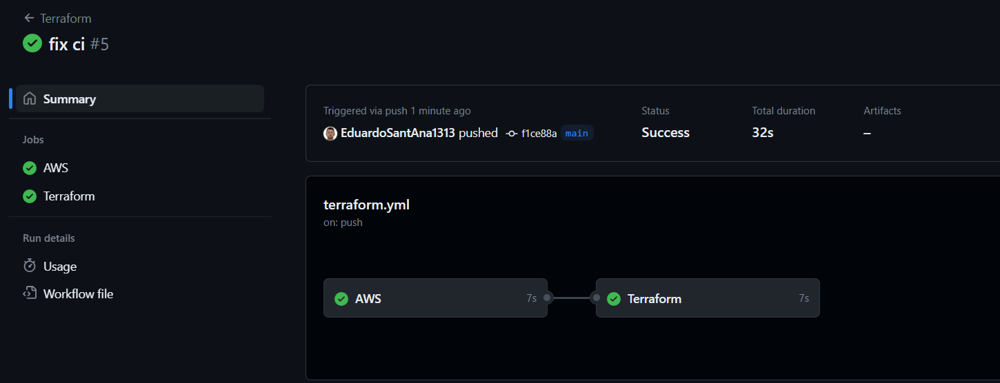

# infra-terraform-actions

Projeto template de CI de infra com terraform via GithubActions.

No arquivo `providers.tf` é configurado o backend para salvar o tfstate em um bucket s3. A configuração do backend é passada via `terraform init` no job do Terraform.

Ao realizar commit/PR para a branch `main` a esteira será inicializada:

1. AWS
    Irá realizar a configuração do aws-cli com o access_key e secret_key armazenados como secret no actions.
2. Terraform
    - Terraform init
        Install do provider e configuração do backend.
    - Terraform formt
        Formatação do código.
    - Terraform plan
        Criação de plano de execução.
    - Terraform apply
        Aplica o plano.
